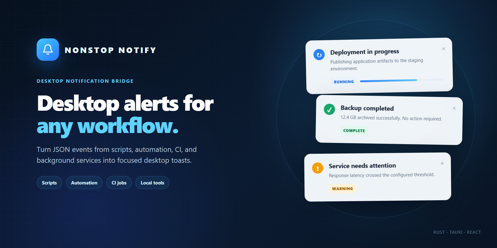

<p align="center">
  
</p>

<p align="center">
  <a href="https://github.com/quangnv13/nonstop-notify/actions/workflows/build.yml"></a>
  <a href="LICENSE"></a>
  
  
</p>

# Nonstop Notify

Nonstop Notify is a lightweight desktop notification bridge for scripts, automation, CI jobs, background services, and local developer tools. Send one JSON event through the CLI and it turns into a focused desktop toast.

It was originally built for the Nonstop test platform, but the event format and CLI are suitable for any workflow that needs visible desktop feedback.

## Highlights

- Accepts notifications as JSON through standard input or a command argument.
- Starts a single background daemon automatically on the first event.
- Updates an existing toast when the same `toastId` is reused.
- Supports loading, success, error, warning, and informational states.
- Shows optional progress, messages, and primary or secondary actions.
- Keeps loading notifications visible until they are updated or dismissed.
- Displays up to five notifications with compact hover expansion.
- Follows the Windows light or dark app theme and uses the light theme on other platforms.
- Supports configurable screen position, offsets, and border width.
- Supports explicit custom sounds and a runtime `notify-ring.mp3` override beside the executable.
- Opens safe relative dashboard routes or absolute HTTP(S) URLs.

## Quick Start

### Windows

Send an event from PowerShell:

```powershell
'{"event":"deploy.started","toastId":"deploy:api","title":"Deploying API","message":"Publishing to staging","status":"loading","progress":0.35}' |
  .\nonstop-notify.exe emit --stdin
```

Update the same toast when the work finishes:

```powershell
'{"event":"deploy.completed","toastId":"deploy:api","title":"Deployment complete","message":"Staging is ready","status":"success","progress":1,"primaryLabel":"View deployment","primaryRoute":"https://example.com/deployments/42"}' |
  .\nonstop-notify.exe emit --stdin
```

The daemon starts automatically. Running it explicitly is optional:

```powershell
.\nonstop-notify.exe daemon
```

### Linux

After installing the DEB package or placing the AppImage binary on `PATH`, send an event from Bash:

```bash
printf '%s\n' '{"event":"deploy.started","toastId":"deploy:api","title":"Deploying API","message":"Publishing to staging","status":"loading","progress":0.35}' |
  nonstop-notify emit --stdin
```

Update the same toast:

```bash
printf '%s\n' '{"event":"deploy.completed","toastId":"deploy:api","title":"Deployment complete","message":"Staging is ready","status":"success","progress":1,"primaryLabel":"View deployment","primaryRoute":"https://example.com/deployments/42"}' |
  nonstop-notify emit --stdin
```

The daemon also starts automatically on Linux. Running it explicitly is optional:

```bash
nonstop-notify daemon
```

## CLI

```text
nonstop-notify emit --stdin [--config PATH]
nonstop-notify emit --json JSON [--config PATH]
nonstop-notify daemon [--config PATH]
nonstop-notify --self-check [--config PATH]
```

| Command | Purpose |
| --- | --- |
| `emit --stdin` | Reads one JSON event from standard input. |
| `emit --json` | Reads one JSON event from the next command argument. |
| `daemon` | Starts the background notification process. |
| `--self-check` | Validates configuration, event parsing, sound decoding, and URL handling. |

Set `NONSTOP_NOTIFY_DEBUG=1` to print CLI errors. Set `NONSTOP_NOTIFY_CONFIG` to provide a default configuration file without passing `--config` each time.

## Event Format

Minimal event:

```json
{
  "event": "job.completed",
  "title": "Job completed",
  "status": "success"
}
```

Full example:

```json
{
  "schemaVersion": 1,
  "event": "backup.progress",
  "toastId": "backup:nightly",
  "groupId": "maintenance",
  "timestamp": "2026-07-26T12:00:00Z",
  "title": "Nightly backup",
  "message": "Uploading archive 7 of 10",
  "status": "loading",
  "progress": 0.7,
  "route": "https://example.com/backups/nightly",
  "actions": [
    {
      "label": "Open logs",
      "route": "https://example.com/backups/nightly/logs",
      "kind": "primary"
    }
  ]
}
```

| Field | Description |
| --- | --- |
| `event` | Required event name. Also used as the title when `title` is empty. |
| `toastId` | Stable identifier used to update an existing toast. Generated when omitted. |
| `title` | Notification heading. |
| `message` | Optional supporting text. |
| `status` | `loading`, `success`, `error`, `warning`, or another informational value. `state` is accepted as an alias. |
| `progress` | Optional number clamped to the `0` to `1` range. |
| `route` | Fallback URL for the primary `Open` action when no explicit action route is supplied. |
| `actions` | Optional action buttons with `label`, `route`, and `kind`. |
| `primaryLabel` / `primaryRoute` | Flat-field alternative for a primary action. |
| `secondaryLabel` / `secondaryRoute` | Flat-field alternative for a secondary action. |

Relative routes beginning with `/` open against the default local Nonstop dashboard at `http://127.0.0.1:4137`. General integrations should use absolute `http://` or `https://` URLs. Empty, protocol-relative, `javascript:`, and `file:` routes are rejected.

## Configuration

Copy `nonstop-notify.config.example.json` and adjust it:

```json
{
  "position": "bottom-left",
  "offsetLeft": 30,
  "offsetRight": 30,
  "borderWidth": 1,
  "soundPath": null
}
```

Supported positions: `top-left`, `top-right`, `bottom-left`, and `bottom-right`.

`soundPath` is optional and takes precedence when set. When omitted or `null`, the daemon first checks for a decodable `notify-ring.mp3` beside the executable. If that runtime override is missing or invalid, Windows uses the native system notification sound and other platforms play a short deterministic WAV generated during the Rust build.

`--self-check` fails when an explicit `soundPath` cannot be read or decoded. A missing or invalid adjacent `notify-ring.mp3` falls back to the default sound without discarding notifications; set `NONSTOP_NOTIFY_DEBUG=1` to log the fallback.

```powershell
.\nonstop-notify.exe emit --stdin --config .\nonstop-notify.config.json
```

## Install

Tagged GitHub releases are built for:

- Windows x64 as an NSIS installer.
- Linux x64 as DEB and AppImage packages.

### Windows

Install with WinGet after the package is published:

```powershell
winget install --id quangnv13.nonstop-notify --exact
```

The NSIS installer adds its install directory to the current user's `PATH`. Close existing terminal windows, open a new terminal, then verify the CLI:

```powershell
nonstop-notify --self-check
```

Uninstalling removes only the `PATH` entry created by the installer.

### Linux DEB

The DEB package installs `nonstop-notify` in `/usr/bin`, so the CLI is immediately available:

```bash
nonstop-notify --self-check
```

### Linux AppImage

AppImage is portable and does not install itself or update `PATH`:

```bash
chmod +x ./Nonstop.Notify_0.1.2_amd64.AppImage
./Nonstop.Notify_0.1.2_amd64.AppImage --self-check
```

Create a stable CLI command when `~/.local/bin` is on `PATH`:

```bash
mkdir -p ~/.local/bin
ln -s "$PWD/Nonstop.Notify_0.1.2_amd64.AppImage" ~/.local/bin/nonstop-notify
nonstop-notify --self-check
```

Until a release is published, build from source using the steps below.

## Build from Source

Requirements:

- Node.js 22+
- Rust stable
- Tauri v2 system dependencies for the target operating system

```powershell
npm.cmd ci --prefix ui-react --ignore-scripts
npm.cmd --prefix ui-react run build
cargo test --locked
cargo tauri build --bundles nsis
```

For frontend development:

```powershell
npm.cmd --prefix ui-react run dev
```

## Privacy and Security

- Notification events remain on the local machine.
- The app does not include analytics, telemetry, advertising, or user accounts.
- Temporary queue, heartbeat, and daemon lock files are stored in the operating system temporary directory.
- Notification actions open only relative dashboard routes or absolute HTTP(S) URLs.
- Treat notification text as visible desktop content and avoid sending secrets in events.

## Code Signing Policy

Free code signing provided by [SignPath.io](https://signpath.io/), certificate by [SignPath Foundation](https://signpath.org/).

- Source repository: `quangnv13/nonstop-notify`
- Build system: GitHub-hosted GitHub Actions runners
- Committers and reviewers: [`quangnv13`](https://github.com/quangnv13)
- Approvers: [`quangnv13`](https://github.com/quangnv13)
- Signing is limited to release artifacts produced from version tags by the repository workflow.
- Signing credentials are not stored in the repository or exposed to project maintainers.
- Privacy policy: This program will not transfer any information to other networked systems unless specifically requested by the user or the person installing or operating it.

Current eligibility and application work are tracked in [`docs/signpath-free-code-signing-checklist.md`](docs/signpath-free-code-signing-checklist.md).

## Release

Release and WinGet submission steps are documented in [`RELEASING.md`](RELEASING.md).

## License

Licensed under the [MIT License](LICENSE).
